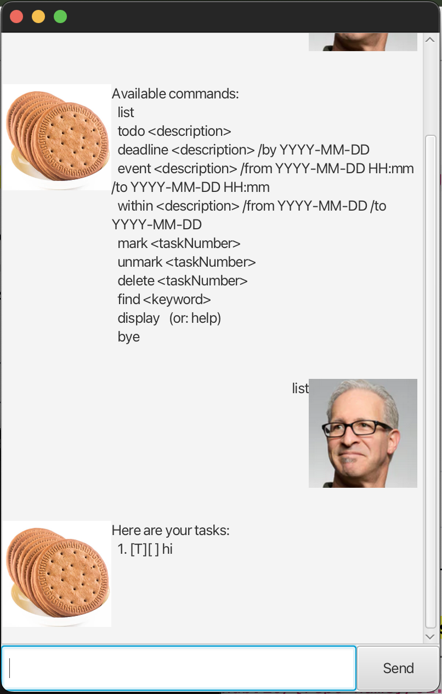

# Biscuit User Guide



Biscuit is a lightweight task-tracking chatbot with a **GUI** (and CLI support) that helps you create, view, and manage tasks. Tasks are **saved automatically** and loaded again when you restart the app.

---

## Quick start

### Run (development)

```bash
./gradlew run
```

### Using the GUI
Type a command into the input box and press **Send** (or Enter). Biscuit will reply in the chat window.

---

## Display commands

Displays the different types of commands that Biscuit can accept, along with how to format each command.

**Format:** `display` (or `help`)

Input:
```text
display
```

Expected output:
```text
Available commands:
  list
  todo <description>
  deadline <description> /by YYYY-MM-DD
  event <description> /from YYYY-MM-DD HH:mm /to YYYY-MM-DD HH:mm
  within <description> /from YYYY-MM-DD /to YYYY-MM-DD
  mark <taskNumber>
  unmark <taskNumber>
  delete <taskNumber>
  find <keyword>
  display   (or: help)
  bye
```

---

## Listing tasks

Lists all tasks with their task numbers (used by `mark`, `unmark`, and `delete`).

**Format:** `list`

Input:
```text
list
```

Expected output (example):
```text
Here are your tasks:
  1. [T][ ] read book
  2. [D][X] EE draft (by: Feb 10 2026)
  3. [E][ ] ballet rehearsal (from: Feb 07 2026 18:00 to: Feb 07 2026 20:00)
  4. [P][ ] collect certificate (between: Jan 15 2026 and Jan 25 2026)
```

If there are no tasks:
```text
No tasks yet.
```

---

## Todo

Adds a todo task (a task with only a description).

**Format:** `todo <description>`

Input:
```text
todo read book
```

Expected output:
```text
Added: [T][ ] read book
```

If the description is missing:
```text
The description of a todo cannot be empty.
```

---

## Adding deadlines

Adds a deadline task (a task that must be done by a certain date).

**Format:** `deadline <description> /by YYYY-MM-DD`

Input:
```text
deadline EE draft /by 2026-02-10
```

Expected output:
```text
Added: [D][ ] EE draft (by: Feb 10 2026)
```

If `/by` is missing:
```text
Usage: deadline <description> /by YYYY-MM-DD
```

If the date format is invalid:
```text
Invalid deadline date. Use YYYY-MM-DD (e.g., 2026-02-10).
```

---

## Adding events

Adds an event task (a task that happens over a time period).

**Format:** `event <description> /from YYYY-MM-DD HH:mm /to YYYY-MM-DD HH:mm`

Input:
```text
event ballet rehearsal /from 2026-02-07 18:00 /to 2026-02-07 20:00
```

Expected output:
```text
Added: [E][ ] ballet rehearsal (from: Feb 07 2026 18:00 to: Feb 07 2026 20:00)
```

If `/from` or `/to` is missing:
```text
Usage: event <description> /from YYYY-MM-DD HH:mm /to YYYY-MM-DD HH:mm
```

If the end is before the start:
```text
Event end must be after the event start.
```

---

## Do-within-a-period tasks (Extension)

Adds a task that must be completed within a date period (inclusive).

**Format:** `within <description> /from YYYY-MM-DD /to YYYY-MM-DD`

Input:
```text
within collect certificate /from 2026-01-15 /to 2026-01-25
```

Expected output:
```text
Added: [P][ ] collect certificate (between: Jan 15 2026 and Jan 25 2026)
```

If the end date is before the start date:
```text
End date must be on or after the start date.
```

If `/from` or `/to` is missing:
```text
Usage: within <description> /from YYYY-MM-DD /to YYYY-MM-DD
```

---

## Mark

Marks a task as done.

**Format:** `mark <taskNumber>`

Input:
```text
mark 2
```

Expected output (example):
```text
Marked as done: [D][X] EE draft (by: Feb 10 2026)
```

If the task number is invalid:
```text
Please provide a valid task number to mark.
```

---

## Unmark

Marks a task as not done.

**Format:** `unmark <taskNumber>`

Input:
```text
unmark 2
```

Expected output (example):
```text
Marked as not done: [D][ ] EE draft (by: Feb 10 2026)
```

---

## Delete

Deletes a task.

**Format:** `delete <taskNumber>`

Input:
```text
delete 1
```

Expected output (example):
```text
Deleted: [T][ ] read book
```

---

## Find

Finds tasks whose descriptions contain the keyword (case-insensitive).

**Format:** `find <keyword>`

Input:
```text
find draft
```

Expected output (example):
```text
Matching tasks:
  1. [D][ ] EE draft (by: Feb 10 2026)
```

If no matches were found:
```text
No matching tasks found for: draft
```

---

## Exit

Exits the application.

**Format:** `bye`

Input:
```text
bye
```

Expected output:
```text
Bye. Hope to see you again soon!
```

---

## Notes

### Task types shown in the list
- `[T]` = Todo
- `[D]` = Deadline
- `[E]` = Event
- `[P]` = Do-within-period task (Extension)
- `[X]` = Done, `[ ]` = Not done

### Date formats
- Deadlines / Within-period tasks: `YYYY-MM-DD` (e.g., 2026-01-25)
- Events: `YYYY-MM-DD HH:mm` (e.g., 2026-02-07 18:00)

---

## Data storage

Biscuit saves tasks automatically (after add/mark/unmark/delete).

Your tasks are stored at:
- `data/biscuit.txt`

You do not need to edit this file manually.
